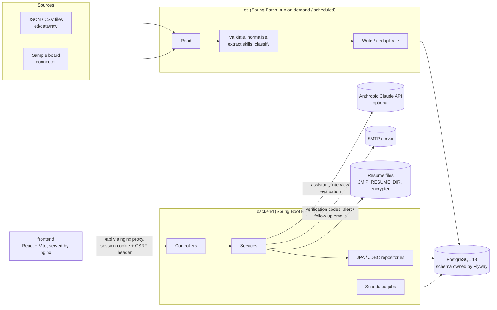
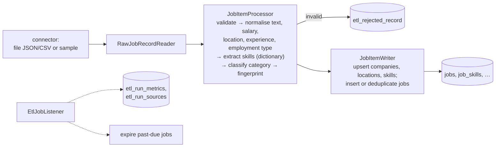
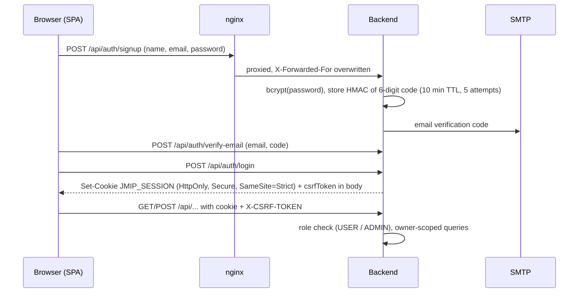

# JMIP architecture

The Job Market Intelligence Platform (JMIP) ingests job postings, turns them into market analytics, and gives
signed-in users career tools on top of that data: resume analysis and building, job matching and recommendations,
an application tracker, career goals and a learning plan, interview practice, personal analytics, a public portfolio
and notifications. This document describes the implementation as it is (V10.7). Setup and run commands are in the
[README](../README.md); production topics in [PRODUCTION_DEPLOYMENT.md](PRODUCTION_DEPLOYMENT.md),
[CI_CD.md](CI_CD.md) and [BACKUP_AND_RECOVERY.md](BACKUP_AND_RECOVERY.md).

## 1. System overview

| Module | Role |
|---|---|
| `database` | Flyway migrations V1–V30, packaged as a jar so the backend and ETL resolve the same schema |
| `etl` | Spring Batch application: ingests postings and reprocesses stored ones |
| `backend` | Spring Boot 3.5 REST API (Java 17): authentication, analytics, all user features, scheduled jobs |
| `frontend` | React 19 + TypeScript SPA built with Vite; nginx serves it and proxies `/api` and health to the backend |

The ETL and the API share only the database. An ingestion run never affects API availability, and the API
learns about new data from the tables (see the ETL metrics and the startup snapshot refresh).

## 2. Backend

Package layout under `com.jmip` (layered):

| Package | Contents |
|---|---|
| `controller` | REST controllers, one per area (`/api/auth`, `/api/jobs`, `/api/resumes`, `/api/applications`, `/api/career-goals`, `/api/learning`, `/api/interviews`, `/api/portfolio`, `/api/public/profiles`, `/api/notifications`, `/api/admin`, …) |
| `service` | Business logic per feature (`auth`, `resume`, `saved`, `application`, `career`, `learning`, `interview`, `assistant`, `market`, `analytics`, `dashboard`, `progress`, `workspace`, `notification`, `onboarding`, `portfolio`, `alert`, `admin`) |
| `repository` | Spring Data JPA repositories for entities and `JdbcTemplate` repositories for analytics and reporting queries |
| `entity`, `dto`, `mapper` | JPA entities, request/response records, mappers |
| `ai` | `AiClient` abstraction with `AnthropicAiClient` (official Anthropic Java SDK) and `StubAiClient`; versioned prompts under `resources/prompts` |
| `config` | Security, CORS, headers, request limits, request logging, scheduling, metrics, production-setting checks |
| `common` | Exceptions and `GlobalExceptionHandler` (one JSON error shape) |

Conventions: Hibernate only validates the schema (`ddl-auto: validate`); every user-owned query is scoped to the
signed-in user's id from the session (`CurrentUser.requireId()`), never to an id sent by the browser; validation
errors are 400, missing or foreign resources 404, conflicts 409.

**Scheduled jobs** run through `ScheduledJobRunner`, which takes a PostgreSQL advisory lock so only one instance
runs a job at a time, tags log lines with a `jobId`, and records the `jmip.scheduled.job` timer:

| Job | Default schedule | Does |
|---|---|---|
| `job-alerts` | hourly | matches new postings to users' job alerts; sends digests (log or SMTP) |
| `skill-snapshots` | 02:00 daily, and at startup | rebuilds the skill demand history from posting dates |
| `resume-retention` | 03:30 daily | deletes resumes past `JMIP_RESUME_RETENTION` (off by default) |
| `follow-up-reminders` | 08:00 daily | reminds users of application follow-ups that fell due |

## 3. Frontend

React 19 + TypeScript, React Router 7, Recharts for charts, Vitest + Testing Library for tests, oxlint.

- `src/api/client.ts`: one `fetch` wrapper; `credentials: 'include'` for the session cookie, the CSRF token kept
  **in memory** and sent as `X-CSRF-TOKEN`; errors become `ApiError` with a user-friendly message (server errors
  show the request id). No token is ever stored in localStorage.
- `src/auth`: `AuthContext` (session state from `/api/auth/me`), `RequireAuth` route guard, OTP input.
- `src/components`: `AppShell` (grouped navigation, notification bell), the design system in `ui.tsx` (cards,
  stats, empty/error states, skeletons), feedback (toasts, confirm dialog), guidance (tooltips, first-visit tips),
  charts.
- `src/pages`: one page per route: dashboard, job explorer and details, recommendations, workspace, applications,
  alerts, resume intelligence and builder, career goals, learning, interview prep, AI assistant, my career, career
  progress, my analytics, notifications, portfolio, public profile, onboarding, settings, help, market analytics,
  admin and ETL monitoring, landing, login, signup and email verification.

## 4. Data model

```mermaid
erDiagram
    companies ||--o{ jobs : posts
    locations ||--o{ jobs : "located in"
    jobs ||--o{ job_skills : requires
    skills ||--o{ job_skills : ""
    jobs ||--o{ job_classification_signals : ""
    job_sources ||--o{ etl_run_sources : ""
    skills ||--o{ skill_demand_snapshot : ""

    users ||--o{ resumes : uploads
    resumes ||--o{ resume_skills : ""
    skills ||--o{ resume_skills : ""
    users ||--o{ saved_jobs : saves
    jobs ||--o{ saved_jobs : ""
    saved_jobs ||--o{ saved_job_status_events : history
    users ||--o{ job_alerts : ""
    job_alerts ||--o{ job_alert_notifications : ""
    users ||--o{ career_goals : ""
    career_goals ||--o{ career_goal_skills : ""
    career_goals ||--o{ career_goal_skill_progress : ""
    users ||--o{ learning_items : ""
    learning_items ||--o{ learning_resources : ""
    users ||--o{ interview_sessions : ""
    interview_sessions ||--o{ interview_questions : ""
    users ||--o| portfolios : publishes
    users ||--o| match_preferences : ""
    users ||--o| user_onboarding : ""
    users ||--o| notification_preferences : ""
    users ||--o{ notifications : ""
    users ||--o{ email_verification_codes : ""
    users ||--o{ hidden_jobs : ""
    users ||--o{ job_views : ""
    users ||--o{ saved_searches : ""
```

| Group | Tables (migration) |
|---|---|
| Market data | `companies`, `locations`, `jobs`, `skills`, `job_skills` (V1); classification `job_classification_signals` (V6); search indexes (V7); job status and deduplication (V17); `job_sources` (V16); `skill_demand_snapshot` (V4) |
| ETL bookkeeping | Spring Batch tables (V2, owned by Flyway); `etl_rejected_record` (V3); `etl_run_metrics` (V8, V22); `etl_run_sources` (V16) |
| Accounts | `users` (V9), names and `email_verification_codes` (V10) |
| Resumes | `resumes`, `resume_skills` (V5), owner (V11), versions (V14), builder content (V24) |
| Job search | `saved_jobs` (V13), `saved_job_status_events` (V20), `job_alerts` (V12), `job_alert_notifications` (V19), `match_preferences` (V18, V23), `hidden_jobs`, `job_views`, `saved_searches` and priorities/follow-ups (V29) |
| Growth | `career_goals`, `career_goal_skills`, `career_goal_skill_progress` (V15), `learning_items`, `learning_resources` (V25), `interview_sessions`, `interview_questions` (V21, V26) |
| Profile | `portfolios` (V27), `user_onboarding` (V28), `notifications`, `notification_preferences` (V30) |

Resume files are not in the database: they are stored in `JMIP_RESUME_DIR` under generated names, AES-256
encrypted when `JMIP_RESUME_ENCRYPTION_KEY` is set (as is the extracted text in the database).

## 5. ETL and Spring Batch

- Jobs: `ingestJobPostings` (default; `inputFile=…` parameter) and `reprocessJobPostings` (re-runs the transform
  on stored postings after dictionary or classifier changes). Each is one chunk-oriented step.
- Fault tolerance: a record that fails validation is skipped and stored in `etl_rejected_record` (up to the skip
  limit); transient database errors are retried. `EtlRunLock` (advisory lock) refuses a second concurrent run.
- After a run the listener records metrics and sources, and marks past-due jobs expired. Run lines carry the job
  execution id in the log; `EtlJobListener` logs one summary line per run.
- The backend reads the Spring Batch tables for ETL monitoring (`/api/etl/runs`, admin page) and publishes the
  latest run as metrics (`jmip.etl.last.run.*`).

## 6. Authentication and security

- Server-side HTTP sessions (Spring Security 6.5); the session id lives only in the cookie. CSRF tokens are
  session-held and required on state-changing requests once a session exists.
- Roles: `USER` for `/api/**`; `ADMIN` for `/api/admin/**` (admins are promoted at startup from
  `JMIP_ADMIN_EMAILS`; nobody can sign up as one).
- Public: sign-up/sign-in/verification, `/api/auth/me`, published profiles `/api/public/profiles/{slug}`, health.
- Defences: per-address rate limits (auth, uploads, AI), request body limits, PDF signature checks on upload,
  exact-origin CORS, security headers and HSTS (backend and nginx), generic error bodies, redacted logs,
  production startup checks (`RequiredProductionSettings`). Details: PRODUCTION_DEPLOYMENT.md, "Public access security".

## 7. Feature modules

| Area | Backend | Frontend | Notes |
|---|---|---|---|
| Market analytics | `analytics`, `market`, `SkillService`, `CompanyService`, `LocationService` | Dashboard, Skills, Skill Trends, Companies, Locations, Job Categories, Market Intelligence | Aggregates over `jobs` and `skill_demand_snapshot`; trend forecasts are labelled estimates |
| Job search | `JobService`, `workspace`, `PersonalizedFeedService` | Job Explorer, Job Details, Recommended for You, Job Workspace | Filtered search, match ordering, hidden jobs, saved searches |
| Resume | `resume` | Resume Intelligence, Resume Builder | PDF upload (PDFBox text extraction), skill matching against jobs, versions, optimisation hints, ATS-friendly builder with PDF export |
| Matching | `resume` (scorers), `match_preferences` | match breakdowns on job pages | Skill match % plus weighted signals (experience, location, work mode, salary, goal), each explained |
| Applications | `saved`, `application` | Applications | Status pipeline with history, notes, priorities, follow-ups, application insights |
| Alerts and notifications | `alert`, `notification` | Job Alerts, Notifications, bell | Hourly alert matching; notifications derived on read, deduplicated, with preferences |
| Career growth | `career`, `learning`, `progress` | Career Goals, Learning & Skills, Career Progress | Skill gap from real postings for a target role; capped readiness score |
| Interview practice | `interview` | Interview Prep | Questions generated deterministically from the posting and resume; answers evaluated by the AI model |
| AI assistant | `assistant` | AI Assistant | Model extracts an intent, the backend validates it and runs whitelisted queries, the model phrases the answer from those results only |
| Personal analytics | `dashboard` | My Career, My Analytics | Funnel, activity, match trend, interview and learning progress |
| Portfolio | `portfolio` | Portfolio, public profile | Private until published; public read-only route by slug |
| Onboarding, settings, help | `onboarding`, `auth` (account) | Onboarding, Settings, Help | Account deletion removes resumes and all user data |
| Administration | `admin`, `EtlRunService` | Admin Dashboard, ETL Monitoring | ADMIN role only |

## 8. Data flow examples

- **Posting to insight**: ETL writes `jobs`/`job_skills` → nightly (and startup) snapshot job rebuilds
  `skill_demand_snapshot` → analytics endpoints aggregate → dashboard charts.
- **Resume to recommendations**: upload → validate (size, type, PDF signature) → encrypt and store file → extract
  text → match skills against the dictionary → `resume_skills` → match scores against jobs → recommendations,
  skill gap, learning suggestions and interview questions.
- **Alert to email**: hourly `job-alerts` job → new matching jobs since the last run → `job_alert_notifications`
  (deduplicated) → digest via SMTP (or log) → notification centre.

## 9. External integrations

| Integration | Used for | Configuration | Without it |
|---|---|---|---|
| PostgreSQL 18 | all data | `JMIP_DB_*` | required |
| Anthropic Claude API (official Java SDK) | AI assistant (intent extraction, answer generation), interview answer evaluation | `AI_PROVIDER`, `AI_API_KEY`, `AI_MODEL` | those features report themselves unavailable; everything else works |
| SMTP (e.g. Gmail app password) | verification codes, alert digests, follow-up reminders | `JMIP_MAIL_*`, `JMIP_VERIFICATION_DELIVERY`, `JMIP_ALERTS_DELIVERY` | codes are written to the log (local development only) |
| File system / volume | encrypted resume files | `JMIP_RESUME_DIR`, `JMIP_RESUME_STORAGE_TYPE=local` | required for uploads |
| GitHub Actions, SonarCloud, Trivy, Dependabot, GHCR | CI/CD, quality gate, dependency scanning, images | repository secrets/variables (CI_CD.md) | development only |

## 10. Architectural decisions

| Decision | Why |
|---|---|
| Separate ETL and API applications sharing only the schema | ingestion load and failures never affect the API; each scales and deploys independently |
| Flyway owns the schema in its own module | one versioned source of truth for both apps; Hibernate only validates |
| Spring Batch for ingestion | restartable chunked processing, skip/retry, run history in the database |
| Server-side sessions + CSRF instead of JWTs in the browser | no tokens in JavaScript-readable storage; immediate logout/revocation |
| Ownership always from the session | the browser can never act on another user's data by changing an id |
| Deterministic logic first, AI only where it adds value | analytics, matching, scoring and interview questions are reproducible and work when the AI provider is down; AI outputs are grounded in backend data |
| `AiClient` abstraction with a stub | tests and local runs need no API key; the provider can change without touching services |
| Derived data rebuilt rather than mutated (snapshots, notifications) | safe to recompute after any load; no drift |
| PostgreSQL advisory locks for jobs and ETL runs | single-run guarantee across instances without extra infrastructure |
| No Redis/Kafka/Kubernetes | the current scale does not need them; fewer moving parts to secure and operate |
| Encrypted resume files behind a `ResumeFileStore` interface | privacy at rest; storage backend replaceable without touching business logic |
